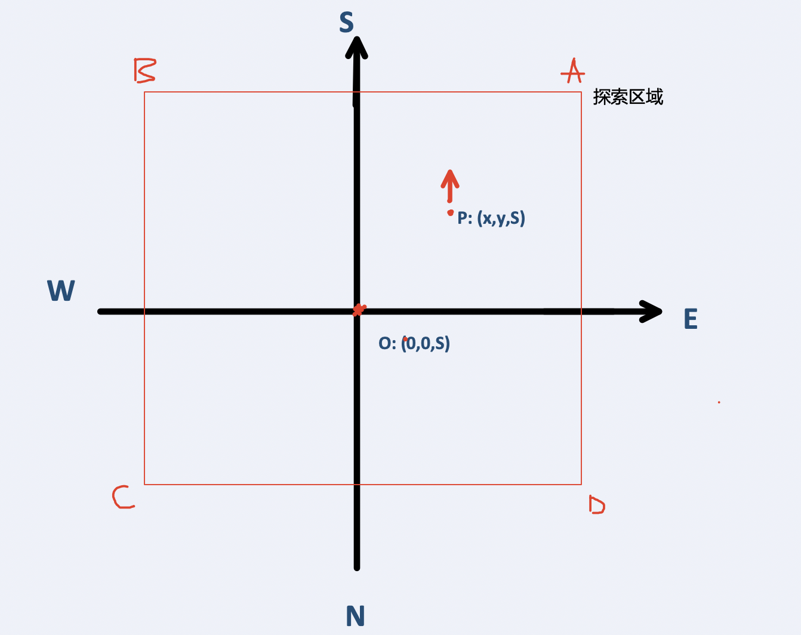
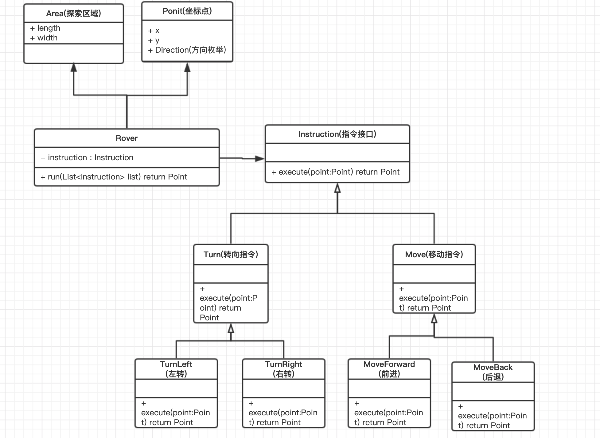
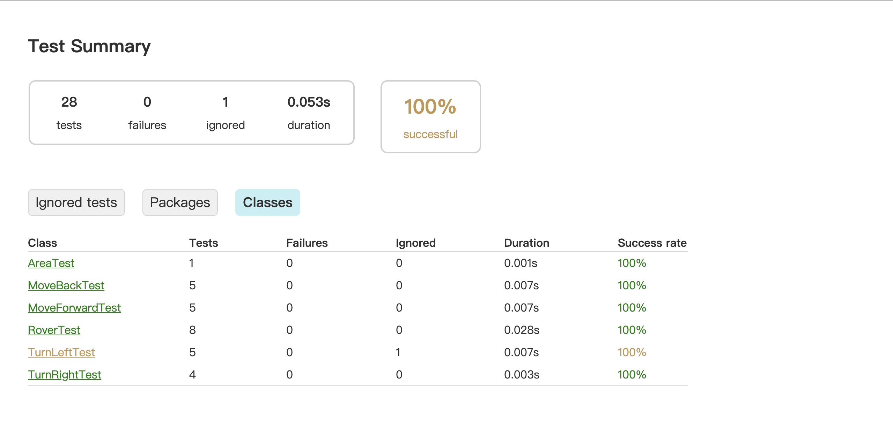
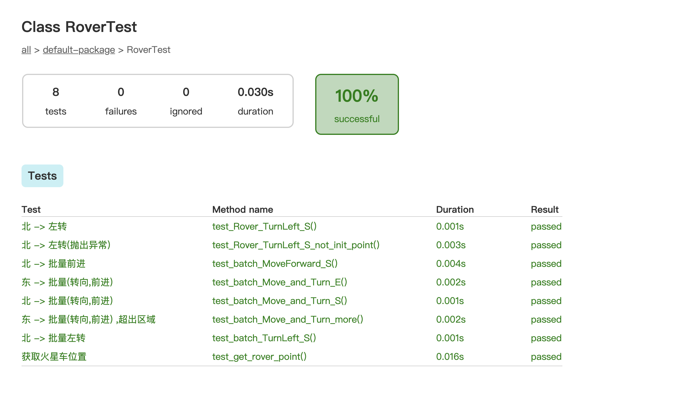

## 

## 项目介绍
   假想你在火星探索团队中负责软件开发。现在你要给登陆火星的探索小车编写控制程序，根据地球发送的控制指令来控制火星车的行动。
   
## 初始需求
   
   火星车收到的指令分为四类：
   
   * 探索区域信息：告知火星车，整片区域的长度（X）和宽度（Y）有多大；
   * 初始化信息：火星车的降落地点（x, y）和朝向（N, S, E, W）信息；
   * 移动指令：火星车可以前进（f）或后退（b）；
   * 转向指令：火星车可以左转90度（l）或右转90度（r）。
   
   由于地球和火星之间的距离很远，指令必须批量发送，火星车执行完整批指令之后，再回报自己所在的位置坐标和朝向。
   

## 扩展需求
   下面是火星探索团队提出的其他一些需求：
   
   * 应该阻止小车跑到超出整片区域坐标系的地方去
   * 火星不是平的，而是球体，所以如果小车从坐标系的一边跑了出去，应该从另一边跑进来
   * 火星地面上有障碍物，如果火星车遇到了障碍物导致后续指令受阻，应该停留在原地，放弃执行后续指令，并立即向地球回报
   
   你需要自己判断，是否采纳这些需求。
   
## 任务1: Mars Rover 初体验

做题要求：

  1. 看懂题目，开始编码之前先花10分钟拆解任务，把任务清单写下来

  2. 计时，开始编码

  3. 要求用TDD的方式实现：先写测试，后写代码
  
  
### 第一步: 拆解任务,设计代码结构

> 注: 以下都是基于我本人对需求的理解,如有不同,欢迎建议, 莫杠 !

只考虑探索二维区域,则探索示意图如下:



分析需求可知,我们的系统应该有以下几种模型: 


* Area: 探索区域,应该由 四个顶点组成的 二维平面坐标系 (A,B,C,D),为了简单,我们假设 Area 为规则的 长方形区域
* Rover: 火星车, 有区域限制(Area)和初始坐标(Point), 并且可以接受一系列指令(Instruction)
* Instruction: 指令接口
* Turn: 转向指令抽象类
* Move: 移动指令抽象类(移动指令会出现越界的可能)

### 第二步: tdd 节奏编码

根据这几次项目的体会,我个人觉得 tdd 最好的开发节奏是这样的:

* 1.分析需求: 弄懂需求,拆解任务
* 2.建模: 就是在脑海中建立一个大概的系统模型图,比如 Mars Rover ,我通过分析需求,抽象出了 Rover ,Instruction 等模型
* 3.分析模型: 行为,边界,职责
* 4.各个击破: 对抽象出的每个模型进行测试开发

#### Area: 探索区域的实现

Area 本身有一个 判断一个point是否在探索区域内的方法. 详细实现请看源码.

Area 的测试类: 

```java
   class AreaTest {   
       @Test
       @DisplayName("测试一个 point 是否在 Area 中")
       void test_Area() {
           Point A = new Point(10, 10, Direction.SOUTH);
           Point B = new Point(-10, 10, Direction.SOUTH);
           Point C = new Point(-10, -10, Direction.SOUTH);
           Point D = new Point(10, -10, Direction.SOUTH);
           Area area = new Area(A, B, C, D);
   
           assertTrue(area.contains(new Point(2, 2, Direction.SOUTH)));
           assertTrue(area.contains(new Point(10, 10, Direction.SOUTH)));
           assertFalse(area.contains(new Point(20, 2, Direction.SOUTH)));
           assertFalse(area.contains(new Point(-11, -11, Direction.SOUTH)));
           assertFalse(area.contains(new Point(-11, 1, Direction.SOUTH)));
           assertFalse(area.contains(new Point(1, 11, Direction.SOUTH)));
   
       }
}
```

#### Turn : 转向指令的实现

Turn 指令分为 Turnleft 和 TurnRight

测试类见 [TurnleftTest.java](https://github.com/itguang/TDD_INACTION/blob/master/mars/src/test/java/TurnLeftTest.java) 
和 [TurnRightTest.java](https://github.com/itguang/TDD_INACTION/blob/master/mars/src/test/java/TurnRightTest.java)

#### Move : 移动指令的实现

  移动指令,需要在移动之后判断 是否超出探索区域

Move 指令分为 MoveForward 和 MoveBack

测试类见 [MoveForward.java](https://github.com/itguang/TDD_INACTION/blob/master/mars/src/test/java/MoveForward.java) 
和 [MoveBack.java](https://github.com/itguang/TDD_INACTION/blob/master/mars/src/test/java/MoveBack.java)


#### Rover: 火星流浪者的实现

Rover 可以接受一系列指令: Instruction,并且有一个 deploy 方法 指定Rover的初始坐标

```java
public class Rover {

    private Point point;

    public void deploy(Point point) {
        this.point = point;
    }

    public Point run(Instruction instruction) {
        if (null == point) {
            throw new RuntimeException("请初始化坐标");
        }
        return instruction.execute(point);
    }

    public Point getPoint() {
        return point;
    }

    public Point run(LinkedList<Instruction> instructions) {
        if (null == point) {
            throw new RuntimeException("请初始化坐标");
        }
        instructions.forEach(instruction -> point = instruction.execute(point));
        return getPoint();
    }
}
```

RoverTest.java

```java
class RoverTest {

    private static Area area;

    @BeforeAll
    static void init() {
        Point A = new Point(10, 10, Direction.SOUTH);
        Point B = new Point(-10, 10, Direction.SOUTH);
        Point C = new Point(-10, -10, Direction.SOUTH);
        Point D = new Point(10, -10, Direction.SOUTH);
        area = new Area(A, B, C, D);
    }

    @BeforeEach
    void setUp() {
    }

    @AfterEach
    void tearDown() {
    }

    @Test
    @DisplayName("获取火星车位置")
    void test_get_rover_point() {
        Rover rover = new Rover();
        Point point = new Point(0, 0, Direction.SOUTH);
        rover.deploy(point);
        assertEquals(rover.getPoint(), point);

    }

    @Test
    @DisplayName("北 -> 左转")
    void test_Rover_TurnLeft_S() {

        // 左转指令
        Instruction instruction = new TurnLeft();

        Rover rover = new Rover();
        rover.deploy(new Point(0, 0, Direction.SOUTH));
        assertEquals(rover.run(instruction).getDirection(), Direction.WEST);
    }

    @Test
    @DisplayName("北 -> 左转(抛出异常)")
    void test_Rover_TurnLeft_S_not_init_point() {

        // 左转指令
        Instruction instruction = new TurnLeft();

        Rover rover = new Rover();
        assertThrows(RuntimeException.class, () -> {
            rover.run(instruction).getDirection();
        });
    }

    @Test
    @DisplayName("北 -> 批量左转")
    void test_batch_TurnLeft_S() {

        // 有序指令集
        LinkedList<Instruction> instructions = new LinkedList<>();
        instructions.add(new TurnLeft());
        instructions.add(new TurnLeft());

        Rover rover = new Rover();
        rover.deploy(new Point(0, 0, Direction.SOUTH));

        assertEquals(rover.run(instructions).getDirection(), Direction.NORTH);
    }

    @Test
    @DisplayName("北 -> 批量前进")
    void test_batch_MoveForward_S() {
        Rover rover = new Rover();
        rover.deploy(new Point(0, 0, Direction.SOUTH));

        // 有序指令集
        LinkedList<Instruction> instructions = new LinkedList<>();
        instructions.add(new MoveForward(area));
        instructions.add(new MoveForward(area));

        Point point = rover.run(instructions);
        assertEquals(point.getDirection(), Direction.SOUTH);
        assertEquals(point.getX(), 0);
        assertEquals(point.getY(), 2);
    }

    @Test
    @DisplayName("北 -> 批量(转向,前进)")
    void test_batch_Move_and_Turn_S() {

        Rover rover = new Rover();
        // 初始坐标 (0,0,S)
        rover.deploy(new Point(0, 0, Direction.SOUTH));

        MoveForward moveForward = new MoveForward(area);
        TurnRight turnRight = new TurnRight();

        // 有序指令集
        LinkedList<Instruction> instructions = new LinkedList<>();
        // 北进2
        instructions.add(moveForward);
        instructions.add(moveForward);
        // 北右转
        instructions.add(turnRight);
        // 东进2
        instructions.add(moveForward);
        instructions.add(moveForward);

        // 最终坐标 (2,2,E)
        Point point = rover.run(instructions);

        assertEquals(point.getDirection(), Direction.EAST);
        assertEquals(point.getX(), 2);
        assertEquals(point.getY(), 2);
    }

    @Test
    @DisplayName("东 -> 批量(转向,前进)")
    void test_batch_Move_and_Turn_E() {

        Rover rover = new Rover();
        // 初始坐标 (0,0,S)
        rover.deploy(new Point(0, 0, Direction.EAST));

        TurnRight turnRight = new TurnRight();
        MoveForward moveForward = new MoveForward(area);

        // 有序指令集
        LinkedList<Instruction> instructions = new LinkedList<>();
        // 连续两次右转 -> (0,0,W)
        instructions.add(turnRight);
        instructions.add(turnRight);

        // 进2 -> (-2,0,W)
        instructions.add(moveForward);
        instructions.add(moveForward);
        // 右转 -> (-2,0,S)
        instructions.add(turnRight);
        // 进2 -> (-2,2,S)
        instructions.add(moveForward);
        instructions.add(moveForward);

        // 最终坐标 (-2,2,S)
        Point point = rover.run(instructions);

        assertEquals(point.getDirection(), Direction.SOUTH);
        assertEquals(point.getX(), -2);
        assertEquals(point.getY(), 2);
    }

    @Test
    @DisplayName("东 -> 批量(转向,前进) ,超出区域")
    void test_batch_Move_and_Turn_more() {

        Rover rover = new Rover();
        // 初始坐标
        rover.deploy(new Point(10, 10, Direction.EAST));

        TurnRight turnRight = new TurnRight();
        MoveForward moveForward = new MoveForward(area);

        // 有序指令集
        LinkedList<Instruction> instructions = new LinkedList<>();

        // 进2
        instructions.add(moveForward);
        instructions.add(moveForward);
        // 连续两次右转
        instructions.add(turnRight);
        instructions.add(turnRight);

        // 进2
        instructions.add(moveForward);
        instructions.add(moveForward);
        // 右转
        instructions.add(turnRight);
        // 进2
        instructions.add(moveForward);
        instructions.add(moveForward);

        // 最终坐标
        assertThrows(RuntimeException.class, () -> rover.run(instructions));

    }

}
```

执行测试,查看测试报告:






